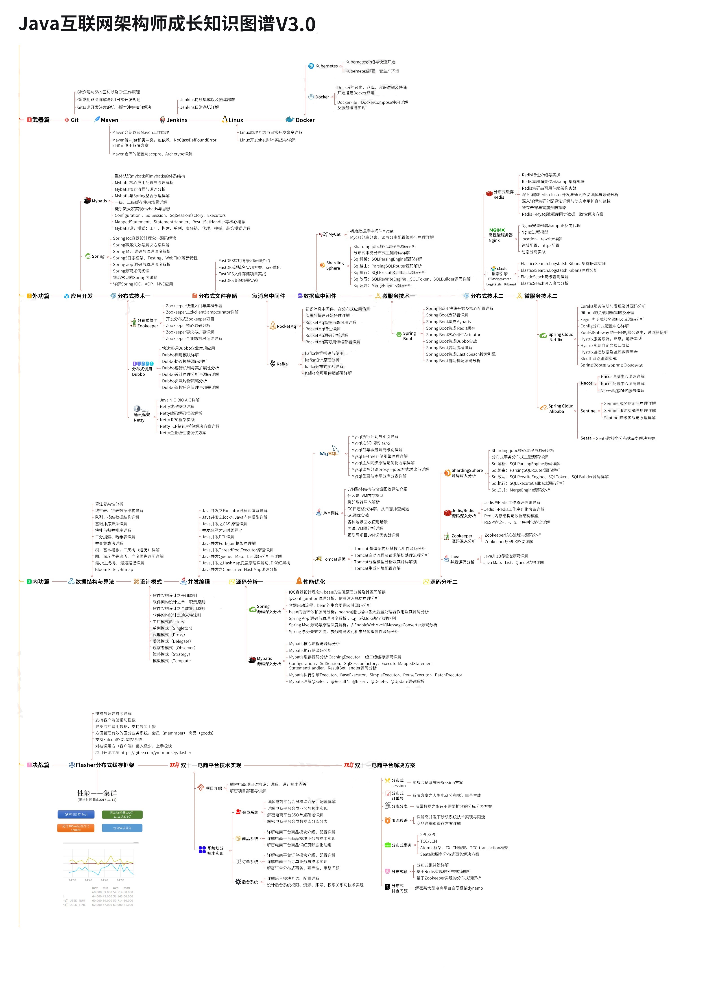

 <h2>简易版分布式架构图</h2> 
 

  
 

 <h1>目录</h1> 
 

## Java

- Java基础
- Java高级
  - 并发
  - [NIO](https://github.com/Duanxiaodai/java_rearrange/blob/master/%E9%98%B6%E6%AE%B5%E4%B8%80%20%E5%9F%BA%E7%A1%80/javase%20%E9%AB%98%E7%BA%A7/NIO/java_NIO.md)
  - [Java 8 特性](https://github.com/Duanxiaodai/java_rearrange/blob/master/%E9%98%B6%E6%AE%B5%E4%B8%80%20%E5%9F%BA%E7%A1%80/javase%20%E9%AB%98%E7%BA%A7/java8%E6%96%B0%E7%89%B9%E6%80%A7/Lambda.md)
  - [JVM](https://duanxiaodai.github.io/JVM+.html )
  - [集合](https://github.com/Duanxiaodai/java_rearrange/blob/master/%E9%98%B6%E6%AE%B5%E4%B8%80%20%E5%9F%BA%E7%A1%80/javase%20%E9%AB%98%E7%BA%A7/%E9%9B%86%E5%90%88/%E9%9B%86%E5%90%88%E5%AF%BC%E5%9B%BE.md)
  - [IO流](https://github.com/Duanxiaodai/java_rearrange/blob/master/%E9%98%B6%E6%AE%B5%E4%B8%80%20%E5%9F%BA%E7%A1%80/javase%20%E9%AB%98%E7%BA%A7/IO%E6%B5%81/IO%E6%B5%81.md)
- 数据结构与算法
  - [算法总结](https://github.com/Duanxiaodai/java_rearrange/blob/master/%E9%98%B6%E6%AE%B5%E9%9B%B6%20%E9%99%84%E5%8A%A0/%E6%95%B0%E6%8D%AE%E7%BB%93%E6%9E%84%E4%B8%8E%E7%AE%97%E6%B3%95/%E6%95%B0%E6%8D%AE%E7%BB%93%E6%9E%84%E4%B8%8E%E7%AE%97%E6%B3%95%E6%80%BB%E7%BB%93.md)
  - 剑指Offer
  - Leetcode
- [设计模式](https://www.processon.com/view/link/5d9aae0de4b0a95d9602ee22)

## 数据库

- [MySQL初级](https://github.com/Duanxiaodai/java_rearrange/blob/master/%E9%98%B6%E6%AE%B5%E4%BA%8C%20Web%E5%9F%BA%E7%A1%80/Mysql/MySQL%E5%9F%BA%E7%A1%80%E7%AC%94%E8%AE%B0.md)
- [MySQL高级](https://www.processon.com/view/link/5d9aa907e4b03347e1330db8)
- [Redis](https://github.com/Duanxiaodai/java_rearrange/blob/master/%E9%98%B6%E6%AE%B5%E5%9B%9B%20%E5%88%86%E5%B8%83%E5%BC%8F/Redis%20%E5%88%9D%E7%BA%A7/redis%E7%AC%94%E8%AE%B0.md)

## 常用框架

- [Spring](https://github.com/Duanxiaodai/java_rearrange/blob/master/%E9%98%B6%E6%AE%B5%E4%B8%89%20%E6%A1%86%E6%9E%B6/Spring/spring%E7%AC%94%E8%AE%B0.md)
- [SpringMVC](https://github.com/Duanxiaodai/java_rearrange/blob/master/%E9%98%B6%E6%AE%B5%E4%B8%89%20%E6%A1%86%E6%9E%B6/SpringMVC/SpringMVC%E7%AC%94%E8%AE%B0.md)
- [Mybatis](https://github.com/Duanxiaodai/java_rearrange/blob/master/%E9%98%B6%E6%AE%B5%E4%B8%89%20%E6%A1%86%E6%9E%B6/Mybatis/Mybatis%E7%AC%94%E8%AE%B0%20.md)
- [SpringBoot](https://github.com/Duanxiaodai/java_rearrange/blob/master/%E9%98%B6%E6%AE%B5%E4%B8%89%20%E6%A1%86%E6%9E%B6/Spring%20Boot%20%E6%A0%B8%E5%BF%83%E7%AC%94%E8%AE%B0/Spring%20Boot.md)
- [SpringBoot整合中间件](https://github.com/Duanxiaodai/java_rearrange/blob/master/%E9%98%B6%E6%AE%B5%E4%B8%89%20%E6%A1%86%E6%9E%B6/Spring%20Boot%20%E6%95%B4%E5%90%88%E7%AF%87%E7%AC%94%E8%AE%B0/springboot%20%E6%95%B4%E5%90%88%E7%AF%87%E7%AC%94%E8%AE%B0.md)

## 分布式设计

- [集群](./Other/mds/分布式笔记/认识微服务.md)
- [分布式](./Other/mds/分布式笔记/认识微服务2.md)
- [Nginx](https://www.processon.com/view/link/5d9aba92e4b07a0a4d4cf2cd)
- Tomcat
- [Dubbo](https://www.processon.com/view/link/5d9abadee4b0aca79ab8cb67)
- [Zookeeper](https://www.processon.com/view/link/5d9abaebe4b07a0a4d4cf340)
- [SpringCloud](https://www.processon.com/view/link/5d9abb00e4b08fc441fbeff2)
- [Redis](https://www.processon.com/view/link/5d9aba65e4b0a95d96030434)
- [ActiveMQ](https://www.processon.com/view/link/5d9aa76de4b07a0a4d4ccf5e)
- [Mycat](https://www.processon.com/view/link/5d9aa9d2e4b0a95d9602e59e)

## 操作系统

- [Linux](https://www.processon.com/view/link/5d9abab8e4b03347e1332e0e)

## 工具

- [Git](https://www.processon.com/view/link/5d9abaa7e4b0aca79ab8cb11)
- [Docker](https://www.processon.com/view/link/5d8b179ae4b011ca2aae2ebe)
- [Maven](https://github.com/Duanxiaodai/java_rearrange/blob/master/%E9%98%B6%E6%AE%B5%E4%B8%89%20%E6%A1%86%E6%9E%B6/Maven/maven%E9%AB%98%E7%BA%A7%E7%AC%94%E8%AE%B0.md)
- [IDEA](Other/mds/00idea入门/idea快速上手指南.md)

## 附加

- [书签栏保存链接](Other/mds/Java学习总结.md)

 <h2>Java架构师成长图谱</h2> 
 

  
 