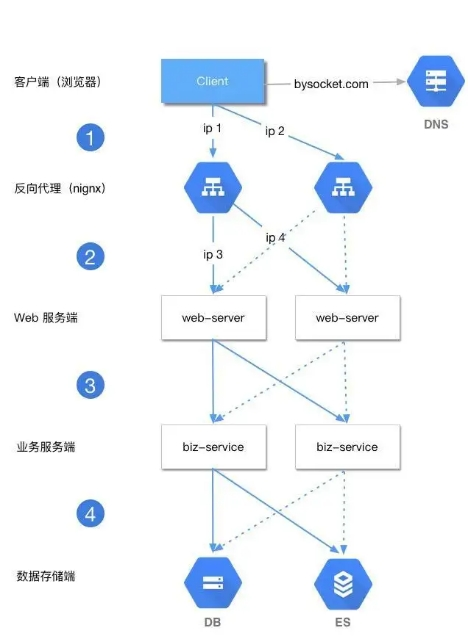

 <h2>简易版分布式架构图</h2> 
 

  
 

# 
 目录

## Java

- Java基础
- java高级
  - 并发
  - NIO
  - Java 8 特性
  - JVM
  - 容器
- 数据结构与算法
  - 剑指Offer
  - Leetcode
- 设计模式
  - 待定

## 数据库

- [MySQL初级](https://github.com/Duanxiaodai/java_rearrange/blob/master/%E9%98%B6%E6%AE%B5%E4%BA%8C%20Web%E5%9F%BA%E7%A1%80/Mysql/MySQL%E5%9F%BA%E7%A1%80%E7%AC%94%E8%AE%B0.md)
- [MySQL高级](https://duanxiaodai.github.io/%E5%AE%8C%E6%95%B4%E7%89%88MySQL%E9%AB%98%E7%BA%A7.html)
- [Redis](https://github.com/Duanxiaodai/java_rearrange/blob/master/%E9%98%B6%E6%AE%B5%E5%9B%9B%20%E5%88%86%E5%B8%83%E5%BC%8F/Redis%20%E5%88%9D%E7%BA%A7/redis%E7%AC%94%E8%AE%B0.md)

## 常用框架

- [Spring](https://github.com/Duanxiaodai/java_rearrange/blob/master/%E9%98%B6%E6%AE%B5%E4%B8%89%20%E6%A1%86%E6%9E%B6/Spring/spring%E7%AC%94%E8%AE%B0.md)
- [SpringMVC](https://github.com/Duanxiaodai/java_rearrange/blob/master/%E9%98%B6%E6%AE%B5%E4%B8%89%20%E6%A1%86%E6%9E%B6/SpringMVC/SpringMVC%E7%AC%94%E8%AE%B0.md)
- [Mybatis](https://github.com/Duanxiaodai/java_rearrange/blob/master/%E9%98%B6%E6%AE%B5%E4%B8%89%20%E6%A1%86%E6%9E%B6/Mybatis/Mybatis%E7%AC%94%E8%AE%B0%20.md)
- [SpringBoot](https://github.com/Duanxiaodai/java_rearrange/blob/master/%E9%98%B6%E6%AE%B5%E4%B8%89%20%E6%A1%86%E6%9E%B6/Spring%20Boot%20%E6%A0%B8%E5%BF%83%E7%AC%94%E8%AE%B0/Spring%20Boot.md)
- [SpringBoot整合中间件](https://github.com/Duanxiaodai/java_rearrange/blob/master/%E9%98%B6%E6%AE%B5%E4%B8%89%20%E6%A1%86%E6%9E%B6/Spring%20Boot%20%E6%95%B4%E5%90%88%E7%AF%87%E7%AC%94%E8%AE%B0/springboot%20%E6%95%B4%E5%90%88%E7%AF%87%E7%AC%94%E8%AE%B0.md)

## 分布式设计

- 集群
- 分布式
- Nginx
- Tomcat
- Dubbo
- [Zookeeper](https://duanxiaodai.github.io/%E5%A4%A7%E6%95%B0%E6%8D%AE%E6%8A%80%E6%9C%AF%E4%B9%8BZookeeper.html)
- [SpringCloud](https://duanxiaodai.github.io/SpringCloud2018(1).html)
- [Redis](https://duanxiaodai.github.io/redis%E5%88%9D%E7%BA%A7%E7%AC%94%E8%AE%B0.html)
- [ActiveMQ](https://duanxiaodai.github.io/ActiveMQ.html)
- Mycat

## 操作系统

- Linux

## 工具

- Git
- [Docker](https://duanxiaodai.github.io/Docker.html)
- [Maven](https://github.com/Duanxiaodai/java_rearrange/blob/master/%E9%98%B6%E6%AE%B5%E4%B8%89%20%E6%A1%86%E6%9E%B6/Maven/maven%E9%AB%98%E7%BA%A7%E7%AC%94%E8%AE%B0.md)

## 附加

- [书签栏保存链接](https://github.com/Duanxiaodai/java_rearrange/blob/master/%E9%98%B6%E6%AE%B5%E4%B8%80%20%E5%9F%BA%E7%A1%80/Java%E5%AD%A6%E4%B9%A0%E6%80%BB%E7%BB%93.md)