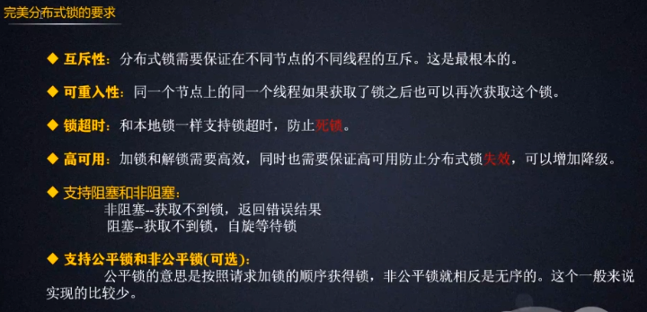
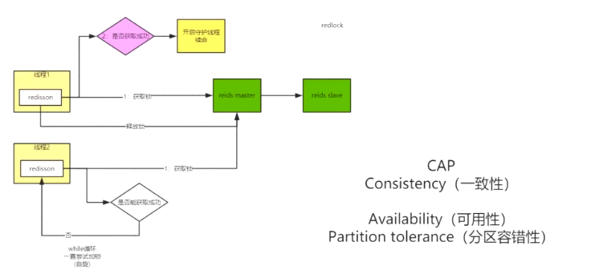

# 一、分布式锁

## 1.1 什么是分布式锁？

分布式锁是控制分布式系统或不同系统之间共同访问共享资源的一种锁实现，如果不同的系统或同一个系统的不同主机之间共享了某个资源时，往往需要互斥来防止彼此干扰来保证一致性。

## 2.2 分布式锁需要具备哪些条件

1. 互斥性：在任意一个时刻，只有一个客户端持有锁。
2. 无死锁：即便持有锁的客户端崩溃或者其他意外事件，锁仍然可以被获取。
3. 容错：只要大部分Redis节点都活着，客户端就可以获取和释放锁

## 1.4 分布式锁的实现有哪些？

1. 数据库

2. Memcached（add命令）

3. Redis（setnx命令）

4. Zookeeper（临时节点）

5. 等等

   

# 二、redis 实现分布式锁

在单机场景下，可以使用语言的内置锁（如：Synchronized，单体jvm级别的）来实现进程同步。

但是在分布式场景下，需要同步的进程可能位于不同的节点上，那么就需要使用分布式锁。

==mysql不用自己加锁？==

是因为在修改时，用事务的方式，已经实现了加锁操作。 

阻塞锁通常使用互斥量来实现：

- 互斥量为 0 表示有其它进程在使用锁，此时处于锁定状态；
- 互斥量为 1 表示未锁定状态。

1 和 0 可以用一个整型值表示，也可以用某个数据是否存在表示。

## 数据库的唯一索引

获得锁时向表中插入一条记录，释放锁时删除这条记录。唯一索引可以保证该记录只被插入一次，那么就可以用这个记录是否存在来判断是否存于锁定状态。

存在以下几个问题：

- 锁没有失效时间，解锁失败的话其它进程无法再获得该锁。
- 只能是非阻塞锁，插入失败直接就报错了，无法重试。
- 不可重入，已经获得锁的进程也必须重新获取锁。

## Redis 的 SETNX 指令

使用 SETNX（set if not exist）指令插入一个键值对，如果 Key 已经存在，那么会返回 False，否则插入成功并返回 True。

SETNX 指令和数据库的唯一索引类似，保证了只存在一个 Key 的键值对，那么可以用一个 Key 的键值对是否存在来判断是否存于锁定状态。

EXPIRE 指令可以为一个键值对设置一个过期时间，从而避免了数据库唯一索引实现方式中释放锁失败的问题。

用ThreadLocal 与 setnx 的 value 解决不可重入问题。

频繁过期（可能有慢查询，或者RPC调用延时，导致key过期）的解决方案，用子线程进行异步续命（用一个新的线程，定时的进行重新设置超时时间）。

## Redisson

Redisson是架设在[Redis](https://baike.baidu.com/item/Redis)基础上的一个Java驻内存数据网格（In-Memory Data Grid）。【Redis官方推荐】

Redisson在基于NIO的Netty框架上，充分的利用了Redis键值数据库提供的一系列优势，在Java实用工具包中常用接口的基础上，为使用者提供了一系列具有分布式特性的常用工具类。使得原本作为协调单机多线程并发程序的工具包获得了协调分布式多机多线程并发系统的能力，大大降低了设计和研发大规模分布式系统的难度。同时结合各富特色的分布式服务，更进一步简化了分布式环境中程序相互之间的协作。

## Redis 的 RedLock 算法

redis ==集群锁失效问题==（如主从模式，如果主节点挂掉，此时从节点提升为主节点，但是主节点上原来的锁没有保持，会出现锁丢失 的问题）

使用了多个 Redis 实例来实现分布式锁，这是为了保证在发生单点故障时仍然可用。

- 尝试从 N 个互相独立 Redis 实例（这些节点都是完全独立的主节点，我们不用任何复制或者其他隐含的分布式协调算法 ）获取锁；这些节点 **完全互相独立，不存在主从复制或者其他集群协调机制** ？？？？这就很奇怪那主从模式的怎么解决呢？？
- 计算获取锁消耗的时间，只有当这个时间小于锁的过期时间，并且从大多数（N / 2 + 1）实例上获取了锁，那么就认为锁获取成功了；
- 如果锁获取失败，就到每个实例上释放锁。

# 三、Zookeeper 的有序节点

## 1. Zookeeper 抽象模型

Zookeeper 提供了一种树形结构的命名空间，/app1/p_1 节点的父节点为 /app1。

 

## 2. 节点类型

- 永久节点：不会因为会话结束或者超时而消失；
- 临时节点：如果会话结束或者超时就会消失；
- 有序节点：会在节点名的后面加一个数字后缀，并且是有序的，例如生成的有序节点为 /lock/node-0000000000，它的下一个有序节点则为 /lock/node-0000000001，以此类推。

## 3. 监听器

为一个节点注册监听器，在节点状态发生改变时，会给客户端发送消息。

## 4. 分布式锁实现

- 创建一个锁目录 /lock；
- 当一个客户端需要获取锁时，在 /lock 下创建临时的且有序的子节点；
- 客户端获取 /lock 下的子节点列表，判断自己创建的子节点是否为当前子节点列表中序号最小的子节点，如果是则认为获得锁；否则监听自己的前一个子节点，获得子节点的变更通知后重复此步骤直至获得锁；
- 执行业务代码，完成后，删除对应的子节点。

## 5. 会话超时

如果一个已经获得锁的会话超时了，因为创建的是临时节点，所以该会话对应的临时节点会被删除，其它会话就可以获得锁了。可以看到，Zookeeper 分布式锁不会出现数据库的唯一索引实现的分布式锁释放锁失败问题。

## 6. 羊群效应

一个节点未获得锁，只需要监听自己的前一个子节点，这是因为如果监听所有的子节点，那么任意一个子节点状态改变，其它所有子节点都会收到通知（羊群效应），而我们只希望它的后一个子节点收到通知。

# 四、并发量暴增如何提升锁性能

分而治之

将一个数据分散，比如1000件商品，分成五份的200，可以用五个key锁（加上负载均衡机制）来进行分散并发压力。